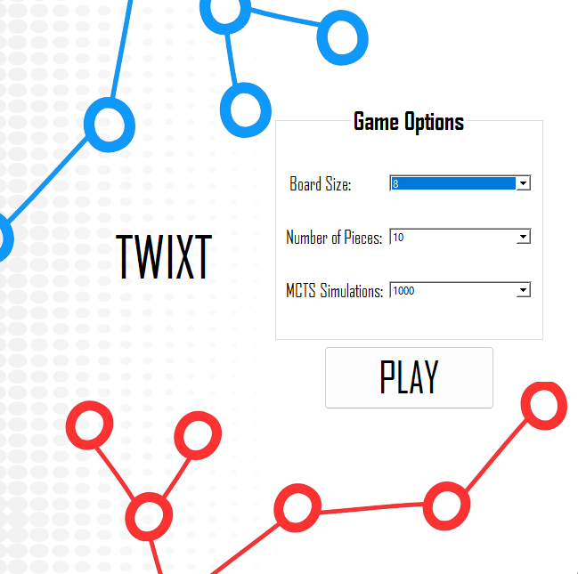
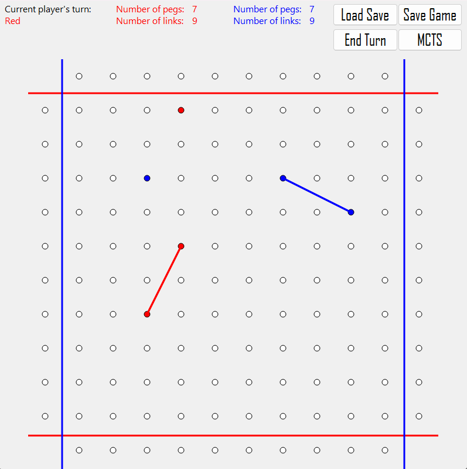
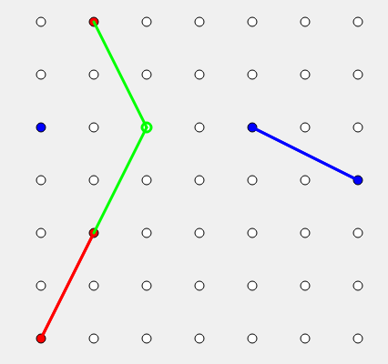

# MCiobi

The project is an implementation of the board game "Twixt" using C++ and the Qt framework.

Besides the basic game it also includes:

- a recommendation system that can help each player make the best move at a given moment. At the request of the player the AI uses Monte Carlo Tree Search to determine the most advantageous move the player can make to win.

- save game functionality

- load game functionality

- the board size, number of pieces and the number of simulations the AI does to provide the recommendations are configurable.

Menu: 

Game window: 

Example of recommendation:
